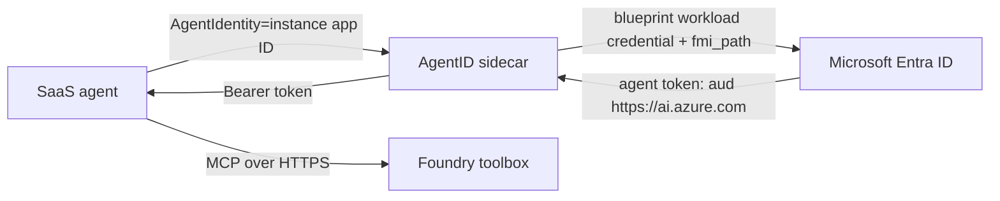

# External SaaS agent with Entra Agent ID

Minimal Python agent using Microsoft Agent Framework, Agent 365 observability,
and a Microsoft Foundry toolbox. The agent authenticates to the toolbox as its
own Microsoft Entra Agent Identity through the Microsoft Entra ID Auth SDK
sidecar.

## Architecture



The blueprint proves that the SaaS workload may operate this class of agent.
The `fmi_path` exchange selects one child Agent Identity, so the toolbox call is
auditable as that agent instance. Do not give the Agent Identity a secret; Agent
Identities cannot own credentials.

## Responsibility split

### Customer tenant administrator

1. Create an Agent Identity Blueprint, its BlueprintPrincipal, and one Agent
	Identity for the SaaS agent instance. Use the typed Microsoft Graph endpoints
	in the [Agent ID setup guide][agent-id-setup].
2. Put the runtime credential on the blueprint. For production, add a federated
	identity credential (FIC) whose issuer, subject, and audience exactly match the
	workload assertion supplied by the SaaS provider.
3. Grant the Agent Identity service principal the **Foundry User** Azure RBAC
	role on the Foundry project containing the toolbox. Assign the role to the
	Agent Identity object ID, not to the blueprint principal.
4. Give the provider only the tenant ID, blueprint application ID, Agent Identity
	application ID, toolbox endpoint, and federation metadata. Do not share a
	client secret.

### SaaS provider

1. Supply a stable workload identity and document its OIDC issuer, subject, and
	audience so the customer can create the FIC.
2. Run the AgentID sidecar privately beside the agent, or implement the documented
	two-step `fmi_path` exchange directly. Never expose the sidecar through an
	ingress or public load balancer.
3. Ask for `https://ai.azure.com/.default` when calling the toolbox and pass the
	resulting `Bearer` value on every MCP request.
4. Set `AGENT_IDENTITY_CLIENT_ID` to the child Agent Identity application ID.
	This value is the `fmi_path`; it is not the service principal object ID.
5. Cache tokens only until expiry, protect workload assertions, and log the Agent
	Identity object/application IDs with each invocation for audit correlation.

If the SaaS cannot host a companion container, it must support external OIDC
workload federation and the two-step Agent ID exchange itself. In that model the
provider exchanges its workload assertion for the parent token, then exchanges
that token as the selected Agent Identity for `https://ai.azure.com/.default`.
Sharing a blueprint client secret is suitable only for a short-lived development
test, not the production handoff.

## Run locally

Local Docker Compose uses a blueprint secret only to make initial testing easy.

```powershell
python -m venv .venv
.venv\Scripts\Activate.ps1
pip install -r requirements.txt
Copy-Item .env.example .env

$env:ENTRA_TENANT_ID = '<tenant-id>'
$env:AGENT_IDENTITY_BLUEPRINT_CLIENT_ID = '<blueprint-app-id>'
$env:AGENT_IDENTITY_BLUEPRINT_CLIENT_SECRET = '<development-only-secret>'
docker compose up -d
python app.py
```

Replace the values in `.env`. `TOOLBOX_ENDPOINT` is the `mcp_endpoint` returned
by `azd ai toolbox show <toolbox-name> --output json`.

The model connection uses `DefaultAzureCredential`; sign in with `az login` for
local development. Toolbox authentication does not use that credential: it uses
the per-instance Agent Identity token returned by the sidecar.

## Production sidecar

Use a federated credential instead of `ClientSecret`. For AKS, label the pod for
Azure Workload Identity and configure:

```yaml
AzureAd__TenantId: <agent-identity-home-tenant>
AzureAd__ClientId: <blueprint-application-id>
AzureAd__ClientCredentials__0__SourceType: SignedAssertionFilePath
DownstreamApis__Toolbox__BaseUrl: https://ai.azure.com
DownstreamApis__Toolbox__Scopes: https://ai.azure.com/.default
DownstreamApis__Toolbox__RequestAppToken: "true"
```

For another SaaS hosting platform, use its external OIDC assertion and configure
the blueprint FIC to match it. Confirm the sidecar/runtime supports that
platform's projected assertion path; otherwise use direct federation.

## Important toolbox behavior

The toolbox endpoint authenticates the caller, while each connection inside the
toolbox separately defines how Foundry authenticates to its downstream tool.
Configure those connections as `agentic-identity` only when the downstream tool
accepts the agent identity and grant the same Agent Identity the required access.

The toolbox returns `require_approval` metadata from `tools/list`, but does not
enforce it on `tools/call`. A production SaaS host must inspect that metadata and
obtain user approval before executing tools marked `always`. This CLI sample's
prompt is a guardrail, not a complete approval UI.

## References

- [Create, test, and deploy a toolbox in Foundry][toolbox]
- [Integrate third-party agents with Entra Agent ID][third-party]
- [Microsoft Entra ID Auth SDK sidecar configuration][sidecar]
- [Agent 365 SDK overview][agent-365]

[toolbox]: https://learn.microsoft.com/azure/foundry/agents/how-to/tools/toolbox?pivots=python
[third-party]: https://learn.microsoft.com/entra/agent-id/configure-third-party-agents
[sidecar]: https://learn.microsoft.com/entra/msidweb/agent-id-sdk/configuration
[agent-id-setup]: https://learn.microsoft.com/entra/agent-id/identity-platform/agent-id-setup-instructions
[agent-365]: https://learn.microsoft.com/microsoft-agent-365/developer/agent-365-sdk