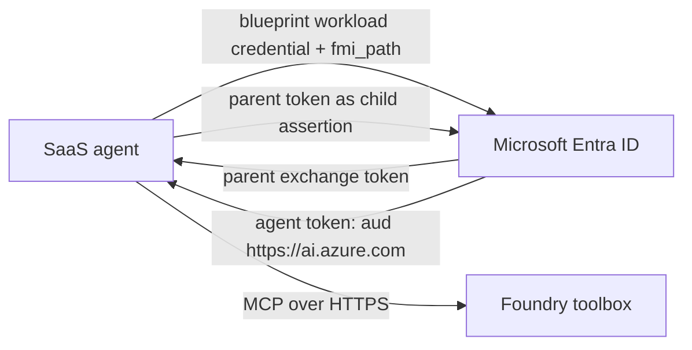

# External SaaS agent with Entra Agent ID

Minimal Python agent using Microsoft Agent Framework, Agent 365 observability,
and a Microsoft Foundry toolbox. The agent authenticates to the toolbox as its
own Microsoft Entra Agent Identity by performing the Agent ID token exchange
directly in the SaaS process.

## Architecture



The blueprint proves that the SaaS workload may operate this class of agent.
The `fmi_path` exchange selects one child Agent Identity, so the toolbox call is
auditable as that agent instance. Do not give the Agent Identity a secret; Agent
Identities cannot own credentials.

## Provision the Entra identities

For interactive administrator setup, install Microsoft Graph PowerShell once:

```powershell
Install-Module Microsoft.Graph.Authentication -Scope CurrentUser -Force
```

Then run the provisioner. It opens an interactive sign-in and requests only the
delegated scopes required by these three operations:

```powershell
.\provision_agent_identity.ps1 `
	-TenantId '<tenant-id>' `
	-BlueprintName 'External SaaS Agent Blueprint' `
	-AgentName 'External SaaS Agent Instance' `
	-SponsorUserId '<sponsor-user-object-id>' `
	-UseDeviceCode
```

The signed-in user must hold a supported Agent ID role. An administrator might
also need to consent to these delegated Microsoft Graph permissions:

- `AgentIdentityBlueprint.Create`
- `AgentIdentityBlueprintPrincipal.Create`
- `AgentIdentity.Create.All`

For unattended automation, the Python provisioner instead uses a dedicated app
registration with the equivalent **application** permissions and tenant-wide
admin consent. Configure its credential and the sponsor's user object ID:

```powershell
$env:ENTRA_TENANT_ID = '<tenant-id>'
$env:AGENT_ID_SETUP_CLIENT_ID = '<setup-application-id>'
$env:AGENT_ID_SETUP_CLIENT_SECRET = '<setup-application-secret>'
$env:AGENT_ID_SETUP_SPONSOR_USER_ID = '<sponsor-user-object-id>'

python .\provision_agent_identity.py `
	--blueprint-name 'External SaaS Agent Blueprint' `
	--agent-name 'External SaaS Agent Instance'
```

The command creates the blueprint, its mandatory BlueprintPrincipal, and one
Agent Identity in that order through the typed Microsoft Graph endpoints. Its
JSON output distinguishes application IDs from object IDs. Set
`AGENT_IDENTITY_BLUEPRINT_CLIENT_ID` and `AGENT_IDENTITY_CLIENT_ID` from the two
application ID values. Use `agent_identity_object_id` when assigning Azure RBAC
to the Agent Identity. The setup secret is only for the provisioning app and
must not be reused as the blueprint runtime credential.

## Responsibility split

### Customer tenant administrator

1. Run the provisioning command above to create an Agent Identity Blueprint,
	its BlueprintPrincipal, and one Agent Identity for the SaaS agent instance.
2. Put the runtime credential on the blueprint. For production, add a federated
	identity credential (FIC) whose issuer, subject, and audience exactly match the
	workload assertion supplied by the SaaS provider.
3. Grant the Agent Identity service principal the **Foundry User** Azure RBAC
	role on the Foundry project containing the toolbox. Assign the role to the
	Agent Identity object ID, not to the blueprint principal.
4. Give the provider only the tenant ID, blueprint application ID, Agent Identity
	application ID, toolbox endpoint, and federation metadata. Do not share a
	client secret.

### SaaS provider

1. Supply a stable workload identity and document its OIDC issuer, subject, and
	audience so the customer can create the FIC.
2. Perform the documented two-step `fmi_path` exchange directly in the SaaS
	process. The implementation is isolated in `agent_identity.py`.
3. Ask for `https://ai.azure.com/.default` when calling the toolbox and pass the
	resulting `Bearer` value on every MCP request.
4. Set `AGENT_IDENTITY_CLIENT_ID` to the child Agent Identity application ID.
	This value is the `fmi_path`; it is not the service principal object ID.
5. Cache tokens only until expiry, protect workload assertions, and log the Agent
	Identity object/application IDs with each invocation for audit correlation.

The provider exchanges its workload assertion for the parent token, then
exchanges that token as the selected Agent Identity for
`https://ai.azure.com/.default`. Sharing a blueprint client secret is suitable
only for a short-lived development test, not the production handoff.

## Run locally

Local development uses a blueprint secret only to make initial testing easy.

```powershell
# python -m venv .venv
.venv\Scripts\Activate.ps1
pip install -r requirements.txt
Copy-Item .env.example .env

$env:ENTRA_TENANT_ID = '<tenant-id>'
$env:AGENT_IDENTITY_BLUEPRINT_CLIENT_ID = '<blueprint-app-id>'
$env:AGENT_IDENTITY_BLUEPRINT_CLIENT_SECRET = '<development-only-secret>'
python app.py
```

Replace the values in `.env`. `TOOLBOX_ENDPOINT` is the `mcp_endpoint` returned
by `azd ai toolbox show <toolbox-name> --output json`.

The model connection uses `DefaultAzureCredential`; sign in with `az login` for
local development. Toolbox authentication does not use that credential: it uses
the per-instance Agent Identity token acquired by the direct exchange.

## Production federation

Configure a federated identity credential on the blueprint whose issuer, subject,
and audience match the SaaS workload identity. Project the resulting OIDC token
into the application and configure:

```text
ENTRA_TENANT_ID=<agent-identity-home-tenant>
AGENT_IDENTITY_BLUEPRINT_CLIENT_ID=<blueprint-application-id>
AGENT_IDENTITY_CLIENT_ID=<agent-identity-application-id>
AGENT_IDENTITY_BLUEPRINT_ASSERTION_FILE=<path-to-projected-oidc-token>
```

Do not also set `AGENT_IDENTITY_BLUEPRINT_CLIENT_SECRET`. The assertion is read
for every token refresh so a hosting platform can rotate the projected token.

## Important toolbox behavior

The toolbox endpoint authenticates the caller, while each connection inside the
toolbox separately defines how Foundry authenticates to its downstream tool.
Configure those connections as `agentic-identity` only when the downstream tool
accepts the agent identity and grant the same Agent Identity the required access.

The toolbox returns `require_approval` metadata from `tools/list`, but does not
enforce it on `tools/call`. A production SaaS host must inspect that metadata and
obtain user approval before executing tools marked `always`. This CLI sample's
prompt is a guardrail, not a complete approval UI.

## References

- [Create, test, and deploy a toolbox in Foundry][toolbox]
- [Integrate third-party agents with Entra Agent ID][third-party]
- [Authenticate autonomous agents with Entra Agent ID][agent-auth]
- [Agent 365 SDK overview][agent-365]

[toolbox]: https://learn.microsoft.com/azure/foundry/agents/how-to/tools/toolbox?pivots=python
[third-party]: https://learn.microsoft.com/entra/agent-id/configure-third-party-agents
[agent-auth]: https://learn.microsoft.com/entra/agent-id/autonomous-agent-authentication-authorization-flow
[agent-id-setup]: https://learn.microsoft.com/entra/agent-id/identity-platform/agent-id-setup-instructions
[agent-365]: https://learn.microsoft.com/microsoft-agent-365/developer/agent-365-sdk